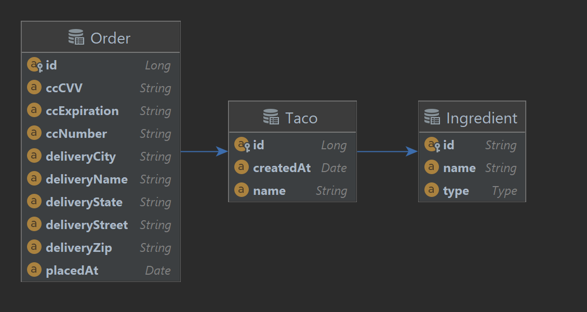

# Online store
[](https://www.oracle.com/java/technologies/downloads/#java17)
[](https://spring.io/projects/spring-boot)
[](https://spring.io/projects/spring-security)
[](https://maven.apache.org/)
[](https://www.h2database.com/html/main.html)

### This project is based on the book Spring in Action, 5th Edition. Author: Craig Walls. It has the ability to create your own tacos.


## Requirements
* Java 17
* Maven 3.8.7 or above

 Clone repository

```shell
https://github.com/pacgds1man/TacoCloud
```

## Run the application with the command:

Maven:
```shell
mvn clean install
```


Create image for Docker
```shell
docker build -t taco-cloud:0.0.1 .
```
Run the container
```shell
docker run -d -p 8080:8080 -t taco-cloud:0.0.1
```
The application is running on port 8080.
